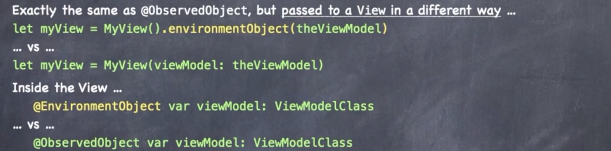

## 属性包装器

```swift
@Published var emojiArt: EmojiArt = EmojiArt()

struct Published {
  var wrappedValue: EmojiArt
  var projectedValue: Publisher<EmojiArt, Never>  
}

var _emojiArt: Published = Published(wrappedValue: EmojiArt())
var emojiArt: EmojiArt {
  get { _emojiArt.wrappedValue }
  set { _emojiArt.wrappedValue = newValue }
}
```

- @State

- @StateObject 与@State类似，用于ObservableObjects

- @Bind 绑定到另一个变量
- @Environment 与@ObservedObject相同，使用viewModifier传递
  - 

  

