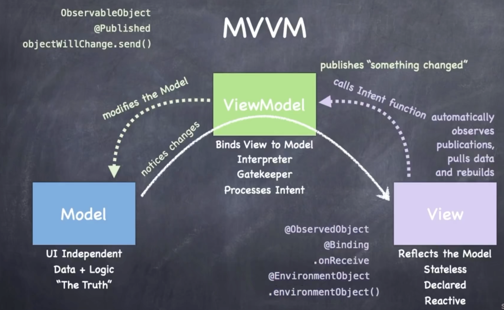

# MVVM

## MVVM 

**设计范式**

**Model-View-ViewModel**

- `Model` -  Model完全独立于UI，Model文件中不需要导入SwiftUI。处理数据和逻辑。游戏的所有数据都在Model中
- `View` - 如何呈现给用户。每一次都需要重绘。如果订阅的更改出现变化，将会请求body var进行重绘。提供Intent
- `ViewModel` - 将Model 连接到View（解释器）。不断跟踪Model变化，公布更改。接受View信息，对模型进行更改




## Swift类型系统

- `struct`和`class` 
  -  struce是值类型，class是引用类型
  - struct写入时才会copy
  - 自动引用计数
  - class可以继承（只有单继承），struct不能
  - 默认init: struct会初z始化所有var, class不会
  - 可变性： struct必须显式指明
  - struct是首选
  
- `Generics`
  - Array
  
- `Functions` & `Closure`
  - (Int, Int) -> Bool
  - (Double) -> Void
  - () -> Void
  
- `enum`
  
  - ```swift
    enum FastFoodMenuItem {
      case hamburger(numberOfPatties: Int)
      case fries(size: FryOrderSize)
      case drink(String, ounces: Int)
      case cookie
      
      func isIncludedInSpecialOrder(number: Int) -> Bool {}
    }
    
    enum FryOrderSize {
      case Large 
      case Small
    }
    
    // switch
    switch menuItem {
      case .hamburger(let pattyCount): print("\(pattyCount)")
      //...
    }
    ```
  
- `Optional`
  
  - ```swift
    enum Optional<T> {
      case none
      case some(T)
    }
    ```
  
  - `?`, `!`, `if let`, `??`, `?.()?.()`
  

