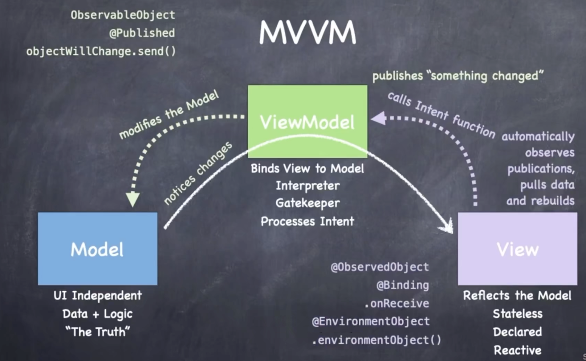

# MVVM

## MVVM 

**设计范式**

**Model-View-ViewModel**

- `Model` -  Model完全独立于UI，Model文件中不需要导入SwiftUI。处理数据和逻辑。游戏的所有数据都在Model中
- `View` - 如何呈现给用户。每一次都需要重绘。如果订阅的更改出现变化，将会请求body var进行重绘。提供Intent
- `ViewModel` - 将Model 连接到View（解释器）。不断跟踪Model变化，公布更改。接受View信息，对模型进行更改




## Swift类型系统

- `struct`和`class` 
  -  struce是值类型，class是引用类型
  - struct写入时才会copy
  - 自动引用计数
  - class可以继承（只有单继承），struct不能
  - 默认init: struct会初z始化所有var, class不会
  - 可变性： struct必须显式指明
  - struct是首选
- `Generics`
  - Array
- `Functions` & `Closure`
  - (Int, Int) -> Bool
  - (Double) -> Void
  - () -> Void

 ## 建立Model

**框架**

```swift
struct MemoryGame<CardContent> {
    var card: Array<Card>
    
    func choose(_ card: Card) {
        
    }
    
    struct Card {
        var isFaceUp: Bool
        var isMatched: Bool
        var content: CardContent
    }
}
```

