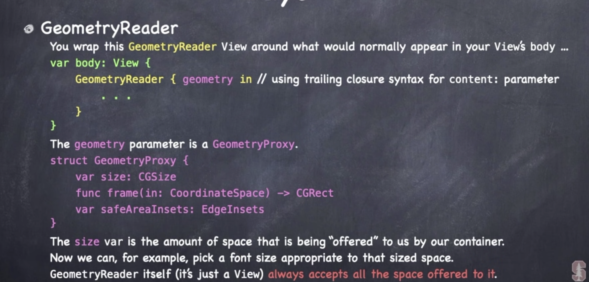
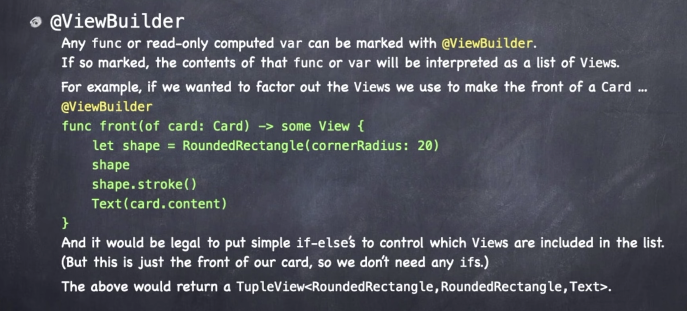

# 属性布局 ViewBuilder

### @State

View 是只读的

在View中跟踪简单的状态

当View重建时，State还是会指向原来的地方

### 属性观察器

属性设置之前执行

```swift
 var is FaFaceUp: Bool {
   willSet {
     if newValue {
       startUsingBonusTiem() 
     } else {
       stopUsingBonusTime()
     }
   }
 }
```

### 布局

```swift
Text("Important").layoutPriority(100)
// 指定获取空间的优先级
```

- **LazyHStack and **
- **LazyVStack** 
- **ScrollView**
- **LazyHGrid and LazyVGrid**
- **List and Form and OutlineGrop**

**ZStack**

 ```swift
 Circle().overlay(Text("Hello"), alignment: .center)
 // 	使用Circle决定大小，而不是文本
 ```

**GeometryReader** 



安全区域

```swift
edgesIgnoringSafeArea([.top])
```

**@ViewBuilder**

 

 