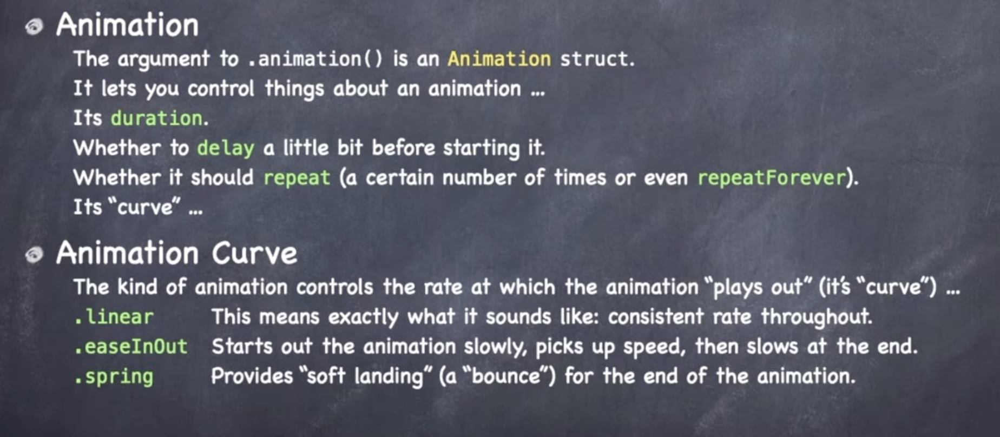
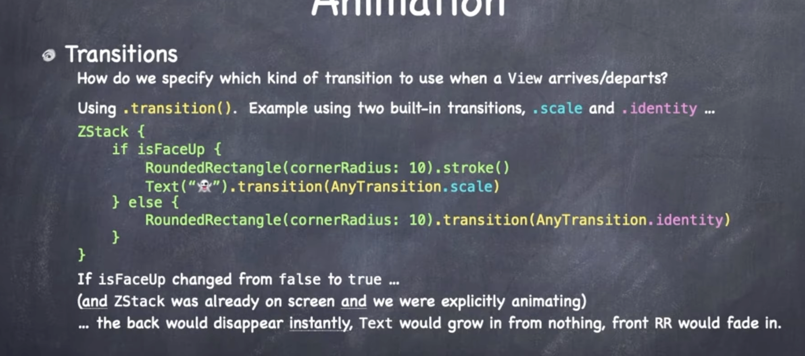
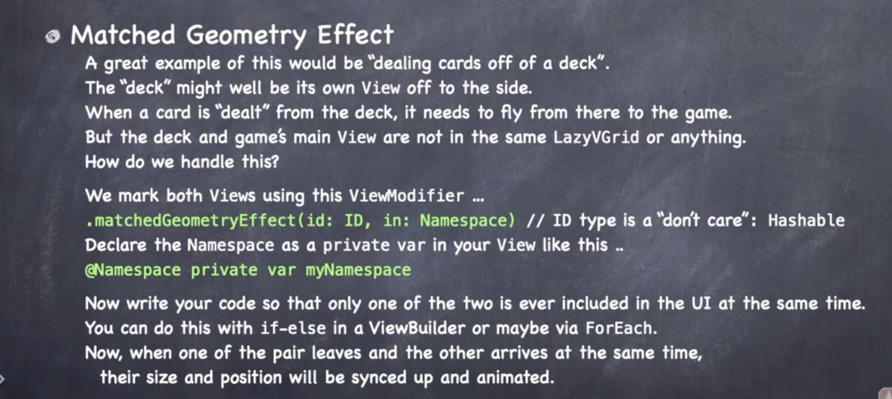

# 动画

## ViewModifier

```swift
protocol ViewModifier {
  typealias Content
  func body(content: Content) -> some View {
    return some View that almost certainly contains the View content
  }
}
```

例

```swift
Text("1").modifier(Cardify(isFaceUp: true))
struct Cardify: ViewModifier {
  var isFaceUp: Bool
  func body(content: Content) -> some View {
    ZStack {
      if isFaceUp {
        RoundedRectangle(cornerRadius: 10).fill(Color.white) 
        RoundedRectangle(cornerRadius: 10).stroke()
        content
      } else {
        RoundedRectangle(cornerRadius: 10)
      }
    }
  }
} 
```

```swift
extension View {
  func cardify(isFaceUp: Bool) -> some View {
    return self.modifier(Cardify(isFaceUp: isFaceUp))
  }
}
```

## 设置动画

必须要有改变才可以设置动画

ViewModifier的参数

Shapes

View中的拓展


- 隐式 .animation(Animation)

  - ```swift
    Text("1")
    	.opcity(scary ? 1 : 0)
    	.rotationEffect(Angle.degrees(upsideDown ? 180 : 0))
    	.animation(Animation.easeInOut)
    
    // 当scary或者upsizeDown变化时，透明度/旋转将会被动画化
    ```

  - 

- 显式 withAnimation(Animation) {}

- Transitions

  - ​	

  - Transitions不会传播内部单独的视图

  - 设置动画细节

  - ```swift
    .transition(AnyTransition.opacity.animation(.linear(duration: 20)))
    ```

- 

- 动画只能在视图出现在屏幕上时才可以进行。`.onAppear { }` 当视图出现时执行闭包


## Demo

```swift
Text(card.content)
	.rotationEffect(Angle.degrees(cards.isMatched ? 360: 0))
.animation(Animation.easeIn)

.font(Font.system(size: 32))
.scaleEffect(scale(thatFits: geometry.size))
```

